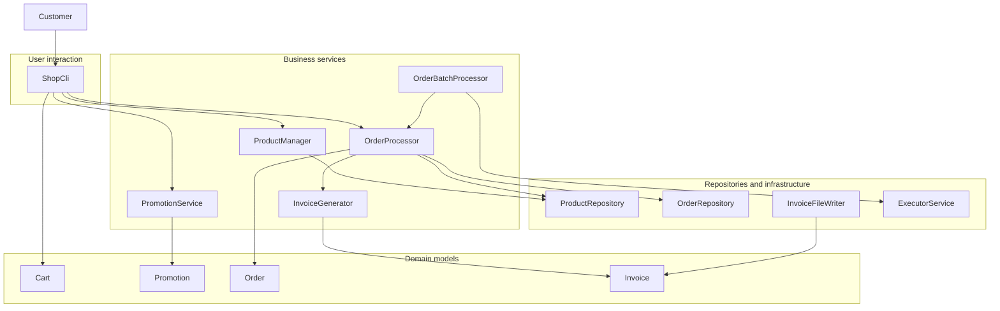

# Online Shop

A Java 21 application representing an online electronics store.

## Project overview

Online Shop is a console-based Java 21 application that simulates
the main business processes of an online electronics store.

The application allows customers to browse available products, add them to a shopping cart, optionally apply a
promotion code and place an order. Each successfully completed order produces an invoice that can be displayed in
the console and saved to a text file.

The project also includes product stock management, timezone-safe timestamps and a separate service for synchronous
and asynchronous batch order processing.

## Features

- management of an electronics product catalogue,
- domain models for standard electronics, configurable computers and smartphones,
- adding products to a shopping cart and changing their quantities,
- placing orders with product availability validation,
- optional percentage-based promotion codes,
- order status management and invoice generation,
- in-memory repositories for products, customers, orders and invoices,
- saving generated invoices to text files,
- timezone-safe order and invoice timestamps,
- synchronous and asynchronous batch order processing,
- protection against overselling during concurrent order processing.

## Order processing flow

The standard order flow starts in the command-line interface and processes one order at a time.

1. The customer browses the available product catalogue.
2. Selected products and quantities are added to the shopping cart.
3. During checkout, cart items are copied to a new order and the customer can optionally enter a promotion code.
4. The order processor verifies that the order is new, finds the requested products and validates their available stock.
5. When all products are available, their stock quantities are decreased and the order is marked as completed.
6. The completed order is stored and used to generate an invoice, which is also saved in the in-memory repository.
7. The shopping cart is cleared, while the invoice is displayed in the console and saved to a text file.

An invalid promotion code stops the checkout and leaves the shopping cart unchanged. If order processing fails, the
order is canceled and the error is returned to the user. A failure while saving the invoice file does not roll back
an already completed order.

## Architecture

### Main components

The application separates domain models, business services, repositories, user interaction and file persistence. The
table below presents the responsibilities of its main components.

| Component                | Responsibility                                                               | Collaborates with                                                                   |
|--------------------------|------------------------------------------------------------------------------|-------------------------------------------------------------------------------------|
| `ShopCli`                | Handles user interaction and coordinates the standard shopping flow          | `ProductManager`, `Cart`, `PromotionService`, `OrderProcessor`, `InvoiceFileWriter` |
| `ProductManager`         | Manages the product catalogue and validates product operations               | `ProductRepository`                                                                 |
| `Cart`                   | Stores products and quantities selected by the customer                      | `Product`, `CartItem`                                                               |
| `PromotionService`       | Finds configured promotion codes used during checkout                        | `Promotion`                                                                         |
| `OrderProcessor`         | Coordinates stock validation, order completion and invoice creation          | `ProductRepository`, `OrderRepository`, `InvoiceRepository`, `InvoiceGenerator`     |
| `OrderBatchProcessor`    | Processes groups of orders synchronously or asynchronously                   | `OrderProcessor`, `ExecutorService`                                                 |
| `InvoiceGenerator`       | Creates an invoice from a processing order                                   | `Order`, `Invoice`                                                                  |
| `InvoiceFileWriter`      | Saves generated invoices as UTF-8 text files                                 | `Invoice`                                                                           |
| `In-memory repositories` | Store products, customers, orders, and invoices during application execution | `Product`, `Customer`, `Order`, `Invoice`                                           |

### Dependency diagram

The following diagram presents the main dependencies between the application's components.



## Concurrent and asynchronous processing

The application provides an `OrderBatchProcessor` for processing groups of orders. It supports both synchronous and
asynchronous execution while reusing the existing `OrderProcessor` responsible for processing a single order.

The `processSync()` method processes orders sequentially on the calling thread. The `processAsync()` method creates
a separate `CompletableFuture` for every order using `supplyAsync()` and submits the tasks to a configurable fixed
thread pool managed by `ExecutorService`.

`CompletableFuture.allOf()` combines all submitted tasks into one completion stage. After every task has finished,
`thenApply()` and `join()` collect the individual order results. The method returns
`CompletableFuture<List<OrderResult>>`. Each OrderResult contains the processed order and either a generated invoice
or the error that occurred, so one failed order does not discard the result of the remaining orders.

`OrderBatchProcessor` implements `AutoCloseable`, so it can be used with try-with-resources. Closing the processor
calls `shutdown()` and waits up to 30 seconds for submitted tasks to finish. If the executor does not terminate in time,
`shutdownNow()` is called.

Concurrent processing requires additional protection for shared data. The in-memory product, order and invoice
repositories use `ConcurrentHashMap`. Stock validation and stock reduction are executed together inside a `synchronized`
block in `OrderProcessor`, preventing concurrent orders processed by the same processor from purchasing more items than
are available.

The command-line interface continues to process individual orders synchronously. Batch processing is exposed as a
separate service and is verified by dedicated concurrency and performance tests.

A local test processing 100 orders with four worker threads and an artificial 100 ms invoice-generation delay completed
in approximately 10.4 seconds synchronously and 2.6 seconds asynchronously. The result demonstrates the benefit of
concurrent execution for independent, time-consuming operations.

## Running the application

The application requires Java 21 and Maven.

Compile the project:

```bash
mvn compile
```

Start the command-line application:

```bash
mvn compile exec:java -Dexec.mainClass=pl.adam.onlineshop.OnlineShopApplication
```

The application can also be started from IntelliJ IDEA by running the `main()` method in `OnlineShopApplication`.

Generated invoices are saved in the `data/invoices` directory.

## Testing

The project uses JUnit 5, AssertJ and Mockito for automated testing.

Run the complete test suite with:

```bash
mvn test
```

The tests cover:

- product, cart, order, and promotion business rules,
- product, order, customer and invoice repositories,
- order processing and invoice generation,
- command-line shopping and checkout flows,
- invoice file persistence,
- deterministic timestamp handling,
- synchronous and asynchronous batch processing,
- protection against overselling during concurrent order processing.

The current test suite contains 119 tests.

## Project status

The application is complete for its current educational scope. It demonstrates the implementation of the main business
processes of an online store together with file persistence, automated tests, timezone-safe timestamps and concurrent
order processing.

## Technologies

- Java 21
- Java Time API (`Instant`, `Clock`, `ZoneId`)
- Java Concurrency API (`ExecutorService`, `CompletableFuture`, `ConcurrentHashMap`)
- Maven
- Lombok
- SLF4J with Simple Logger
- JUnit 5
- AssertJ
- Mockito
- Git
- GitHub Flow

## Author

Adam
